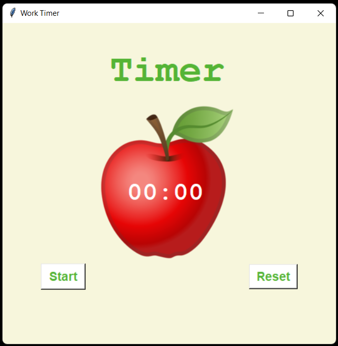

# work-timer
A timer for work built with Python, Tkinter (GUI for Python) and Canvas  

- When press "**Start**" button:
  - Text will show "**Work**" and count down 25 minutes
  - After 25 minutes work, timer will show "**Break**" and count down 5 minutes for a short break
  - After 4 sets of 25-minute work, timer will count down 20 minutes for a long break
  - A check mark will show up when each 25-minute work finishes.

- When press "**Reset**" button:
  - Reset all text, timer and check marks to initial values.
  
  

